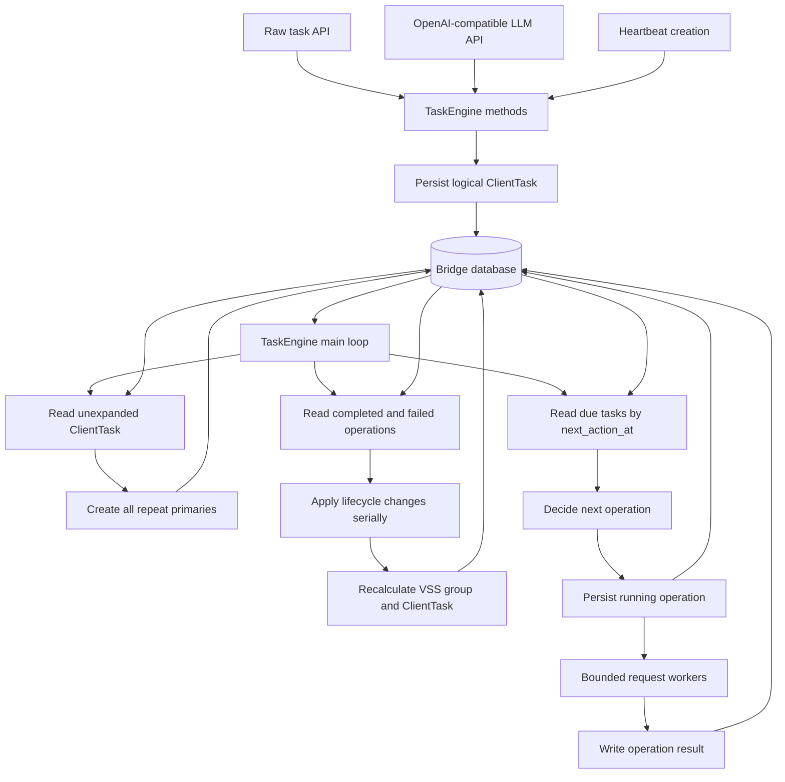

# Task Engine

This document specifies the Bridge task-processing component used by the raw task API, OpenAI-compatible LLM APIs, and heartbeat tasks.

## Responsibilities

TaskEngine is the Bridge component responsible for completing one logical task from submission through final result or final failure.

TaskEngine MUST provide:

- submission of one logical task;
- immediate return of the logical task identity for asynchronous APIs;
- reading the current task status;
- reading the final task result.

For each logical task, TaskEngine MUST:

- create and track the request-level `ClientTask`;
- expand the configured repeat attempts;
- submit every required task to Relay;
- create the additional members required by VSS;
- track Relay state for every repeat and VSS member;
- submit single-task or VSS group validation;
- download successful results;
- return the first successful result;
- determine final failure only after every possible result has failed;
- continue unfinished processing after Bridge restarts.

TaskEngine MUST also process heartbeat tasks through the same task lifecycle. API handlers MUST only authenticate requests, convert API input into a logical task submission, call TaskEngine creation and read methods, perform API-layer status polling when a synchronous response is required, and convert TaskEngine output into the API response.

SDFT orchestration is outside TaskEngine and is specified in [sdft_tasks.md](./sdft_tasks.md). This TaskEngine implementation MUST NOT contain SDFT checkpoint inspection, continuation, retry, completion, timeout, input-upload, or result-download behavior. The existing SDFT APIs and processing code are outside this TaskEngine replacement and MUST remain unchanged.

## Component Boundary

Bridge MUST run one `TaskEngine` instance for one Bridge database. Multiple Bridge processes MUST NOT process tasks concurrently from the same database.

`TaskEngine` MUST provide task creation, task processing, task status reading, and result reading without depending on HTTP handlers or OpenAI response types.

API handlers MUST own authentication, API-specific input conversion, and API-specific output conversion. They MUST NOT implement Relay polling, VSS group waiting, repeat-task waiting, result downloading, or `ClientTask` completion.

All database operations for `ClientTask`, `InferenceTask`, task processing operations, and task result metadata MUST be implemented inside TaskEngine. API handlers MUST NOT read or write those records directly.

TaskEngine MUST expose methods for:

- creating one logical task;
- reading a logical task status;
- reading a logical task result.

The raw and OpenAI-compatible handlers and heartbeat component MUST call the same logical-task creation method. TaskEngine MUST use the same submission-creation path and MUST NOT branch on whether a submission came from an API or heartbeat. The raw status and result handlers MUST call TaskEngine read methods.

The raw task API MUST remain asynchronous:

1. `POST /v1/inference_tasks` MUST create and persist one logical `ClientTask` submission through `TaskEngine`.
2. The endpoint MUST return the persisted `ClientTask` without waiting for Relay execution.
3. Status and results MUST remain available through the raw task status and result endpoints.
4. The response MUST NOT contain an `InferenceTask` or a list of `InferenceTask` records.

The OpenAI-compatible `/completions` and `/chat/completions` endpoints MUST remain synchronous:

1. The endpoint MUST create the task through the same `TaskEngine` task-creation path.
2. The endpoint MUST poll logical task status by `ClientTaskID` through the same TaskEngine status method used by the raw task status endpoint.
3. When the logical task succeeds, the endpoint MUST read the result through the same TaskEngine result method used by the raw task result endpoints.
4. The endpoint MUST convert the result to its existing OpenAI-compatible response.

The APIs MUST NOT add a mode field or separate synchronous and asynchronous routes.

HTTP request cancellation MUST stop only that request's API-layer status polling. It MUST NOT stop persisted task processing or cancel the Relay task.

## Submission and Repeat Expansion

A raw, OpenAI-compatible, or heartbeat submission MUST represent one logical task. Its caller MUST pass that submission to the common TaskEngine creation method and MUST NOT create repeat tasks itself.

TaskEngine's logical-task submission MUST contain an optional `repeat_num`. When `repeat_num` is present, TaskEngine MUST use that value. When it is absent, TaskEngine MUST use `task.repeat_num` from Bridge configuration. The selected value MUST be greater than `0`.

TaskEngine's task-creation method MUST execute the database transaction that creates exactly one `ClientTask` for the submission. The `ClientTask` MUST persist the normalized task specification, selected `repeat_num`, repeat-expansion state, and `next_action_at`. The method MUST NOT create an `InferenceTask`.

For a raw API submission, the API handler MUST pass the authenticated API key identity to TaskEngine. TaskEngine MUST apply the API-key usage update in the same transaction as the `ClientTask` creation.

The main loop MUST select unexpanded `ClientTask` records whose `next_action_at` is due. It MUST create the effective `repeat_num` primary `InferenceTask` rows and mark repeat expansion complete in one database transaction. If the transaction fails, no primary task or expansion-state change may remain, and the main loop MUST schedule another attempt.

After successful repeat expansion, the main loop MUST clear the task specification stored temporarily on `ClientTask`. Every primary `InferenceTask` MUST retain the complete task specification required for Relay processing.

Each repeat primary MUST:

- have a distinct `TaskID`, nonce, and task commitment;
- contain the same submitted task arguments and execution requirements;
- reference the same `ClientTaskID`;
- enter scheduling with `next_action_at` set to the current time.

Heartbeat task submissions MUST explicitly set `repeat_num` to `1`. OpenAI-compatible submissions MUST omit `repeat_num` and use the configured value. A raw task submission MAY provide `repeat_num`; when it omits the field, TaskEngine MUST use the configured value.

VSS expansion is separate from repeat expansion. After Relay returns the sampling seed for a primary, TaskEngine MUST calculate the VRF result and create two additional VSS members when validation is required.

The external API MUST expose only the logical task:

- raw task creation MUST return one `ClientTaskID`;
- raw status MUST return logical task state without returning internal repeat or VSS members;
- raw result APIs MUST select the result under that `ClientTaskID`;
- OpenAI-compatible LLM APIs MUST return the first successfully downloaded result under that `ClientTaskID`;
- repeat primary IDs and VSS membership MUST remain internal processing details.

## Persisted Scheduling State

The Bridge database MUST be the only source of task scheduling state used by the main loop. API handlers and the heartbeat component MUST call TaskEngine methods, and those methods MUST commit logical task submissions without notifying the main loop. Request workers MUST persist their output without sending operation-completed notifications to the main loop.

Each unexpanded `ClientTask` MUST persist:

- the normalized task specification;
- the effective `repeat_num`;
- whether repeat expansion is complete;
- `next_action_at`;
- the latest repeat-expansion error.

Each `InferenceTask` MUST persist:

- its existing local lifecycle state;
- `next_action_at`;
- the current I/O operation type;
- the current I/O operation state;
- the I/O operation start time;
- the I/O operation result;
- the I/O operation error;
- retry information required to calculate the next action time.

The I/O operation state MUST distinguish:

- no operation;
- running;
- completed;
- failed.

A newly committed `ClientTask`, primary task, or VSS member MUST set `next_action_at` to the current time.

TaskEngine MUST use these indexes:

- `(repeat_expanded, next_action_at, id)` for logical tasks awaiting repeat expansion;
- `(operation_status, next_action_at, id)` for due tasks;
- `(operation_status, id)` for completed and failed operations;
- `(task_id, sequence, id)` for VSS groups;
- `(client_task_id, status, id)` for client-task completion.

TaskEngine MUST query due tasks with indexed limits. It MUST NOT load all unfinished tasks, use `OFFSET` pagination over a changing unfinished set, or keep one long-running goroutine per task.

## Main Loop

TaskEngine task submission and TaskEngine background processing are separate parts of the same component:

- `TaskEngine.CreateTask` MUST run synchronously for the API call. It MUST persist only the logical `ClientTask` submission before returning.
- The main loop MUST create every repeat primary from that persisted submission.
- The main loop MUST process every repeat primary through the same lifecycle.
- The main loop MUST create VSS members later because VSS selection is known only after Relay returns the primary task's sampling seed.

TaskEngine MUST run one main processing loop. Only this loop may:

- decide the next operation for a task;
- change local task lifecycle fields;
- create every repeat primary;
- process every repeat primary and every VSS member;
- create VSS members;
- decide whether a VSS group is ready;
- decide whether to submit single-task or group validation;
- update `ClientTask.Status` and `ClientTask.FailedCount`;
- calculate retry time and `next_action_at`.

Each iteration MUST execute these steps in order:

1. Select a bounded batch of unexpanded `ClientTask` records whose `next_action_at` is due.
2. Create all repeat primaries for each selected logical task in one transaction.
3. Select a bounded batch of tasks whose operation state is completed or failed.
4. Apply those operation results to local lifecycle state.
5. Recalculate affected VSS groups and client tasks.
6. Clear the applied operation fields and persist the next action time.
7. Determine available capacity in each request worker pool.
8. Select a bounded batch of tasks whose operation state is empty and whose `next_action_at` is due.
9. Decide the next operation for each selected task.
10. Persist the operation type, running state, and start time before submitting work.
11. Submit only as many operations as the corresponding worker pool can accept.
12. Wait for `task_scan_interval` before beginning the next iteration.

The loop MUST NOT receive `TaskCommitted` or `OperationCompleted` events.

`task_scan_interval` MUST bound:

- the time before a newly committed task is discovered;
- the time before a completed I/O result is applied;
- the time before a due Relay status query is submitted.

An idle iteration MUST issue only bounded indexed queries. Its query cost MUST NOT grow linearly with the total number of unfinished tasks.



## Request Workers

TaskEngine MUST use bounded request workers for:

- Relay batch task creation;
- Relay batch status queries;
- Relay batch validation;
- Relay batch cancellation;
- whole-task result download.

One request worker MUST execute one bounded Relay request. A create, status, validation, or cancellation request MAY contain multiple independent task operations. A result-download request MUST return the single JSON result for one LLM task or all result images for one SD task and MUST NOT contain results from another task.

A request worker MUST execute only its assigned external request. It MUST NOT change task lifecycle state, VSS group state, or client-task state. For a batch response, it MUST write a completed or failed operation result for every task or validation unit in the request and then finish. It MUST NOT notify the main loop.

Create, status, validation, cancellation, and result-download operations MUST each use an independently bounded worker pool. Capacity used by one operation type MUST NOT reduce the configured worker capacity of another operation type.

One task MUST have at most one running I/O operation. The main loop MUST NOT start another operation for that task until the current worker has written completed or failed.

Every external operation MUST use an explicit context timeout. An operation implementation MUST NOT contain an unbounded retry loop. A transient failure MUST be written as a failed operation; the main loop MUST schedule any retry.

The worker wrapper MUST recover a panic and write a failed operation. Normal return, context timeout, and recovered panic MUST all produce completed or failed operation state.

If writing the operation result fails, the worker MUST retry that database write while the Bridge process context remains active. It MUST NOT silently exit while the operation remains running.

## Process Restart

When the Bridge process exits, all of its request workers cease to exist. On startup, TaskEngine MUST treat every persisted running operation as interrupted.

Before retrying an interrupted external write, TaskEngine MUST reconcile every affected task with Relay batch status:

- interrupted task creation MUST query Relay by commitment before including the task in another create batch;
- interrupted validation MUST query every affected task before including the validation unit in another validation batch;
- interrupted sibling cancellation MUST query the sibling before including it in another cancellation batch;
- interrupted result download MUST query Relay success state before downloading again.

If Relay confirms the external operation already took effect, TaskEngine MUST continue from Relay's current state. If Relay confirms it did not take effect and the current state still requires that operation, TaskEngine MUST submit the operation again.

An LLM result download MUST write `0.json` to a temporary file and rename it only after the complete response succeeds. An SD result download MUST write the streamed ZIP archive and extracted images under a temporary task directory, verify every expected numeric image index and reject every unexpected archive path, then rename the temporary directory to the final result path. Startup MUST ignore or delete incomplete temporary files and directories.

## Relay Status Synchronization

Relay task state MUST remain authoritative after Relay accepts a task.

Bridge and Relay MUST provide a signed batch status API. The request MUST contain a bounded, deduplicated list of task commitments for one creator.

The response for each commitment MUST contain only the fields required by TaskEngine:

- task status;
- abort reason;
- task error;
- sequence;
- sampling seed;
- selected execution GPU name and GPU VRAM when available;
- estimated execution completion time when Relay has assigned the exact execution GPU;
- result availability;
- not-found state.

The response MUST NOT include task arguments. It MUST preserve request order and MUST return the same not-found representation for an absent task and a task owned by another creator.

TaskEngine MUST group due status queries by creator and split them by the Relay batch limit. A batch-status request worker MUST write one operation result for each task in the batch. The main loop MUST apply each task's result independently on the next iteration.

Relay MUST calculate the estimated execution completion time from the task start time and the exact-GPU execution estimate used as the input to Relay's execution deadline calculation. Bridge MUST NOT duplicate Relay's execution-time formula.

TaskEngine MUST use shorter status intervals while waiting for node assignment, required VSS-member creation, VSS readiness, validation, or result availability.

After Relay has assigned the exact execution GPU and TaskEngine has created every required VSS member, TaskEngine MUST set:

```text
next_action_at = max(
    current_time + task_scan_interval,
    estimated_execution_completion_time - execution_poll_advance
)
```

TaskEngine MUST NOT poll that task again before `next_action_at`. If Relay still reports an execution state at that time, TaskEngine MUST use `execution_overrun_poll_interval` until Relay reports the next state.

`execution_poll_advance`, `execution_overrun_poll_interval`, batch size, scan interval, and the separate create, status, validation, cancellation, and result-download worker limits MUST be configurable.

## Relay Batch Mutations

TaskEngine MUST group due create, validation, and cancellation operations by creator and operation type, split them by the corresponding Relay batch limit, and submit one request job per resulting batch. It MUST NOT wait beyond the next normal main-loop iteration to fill a partially populated batch.

Relay batch mutations MUST report an independent outcome for every item. TaskEngine MUST apply:

- `created`, `already_exists`, `validated`, `already_applied`, `cancelled`, and `already_cancelled` as successful operation results;
- permanent input, ownership, commitment-conflict, invalid-proof, and invalid-state outcomes as failed operation results that are not automatically retried;
- temporary Relay or infrastructure outcomes as failed operation results with a persisted retry time.

Loss of an HTTP response, request timeout, process interruption, or a whole-request server error leaves every affected mutation outcome unknown. TaskEngine MUST use batch status to reconcile those tasks before retrying the mutation. It MUST retry only items whose current Relay state confirms that the requested mutation did not take effect and is still required.

One create batch MAY partially succeed. Each item MUST retain its own Relay transaction, task fee charge, and response outcome. TaskEngine MUST NOT roll back or locally fail successful items because another item failed.

One validation batch MAY contain independent single-task and three-member VSS validation units. Each unit MUST retain its existing atomic validation boundary. TaskEngine MUST store the batch operation on the deterministic owner of each unit and MUST apply each unit's result independently.

One cancellation batch MAY partially succeed. Sibling cancellation remains best effort; a `not_cancellable`, `not_found`, or permanent rejection outcome MUST finish that cancellation operation and MUST NOT delay client-task completion.

## Task Progression

For each due task, the main loop MUST use the following rules:

1. A local `Pending` task without confirmed Relay state MUST query Relay when it already has a commitment.
2. If Relay does not contain the commitment, the next operation MUST create the Relay task.
3. If Relay contains the task, TaskEngine MUST synchronize Relay state before taking another lifecycle action.
4. Sequence, sampling seed, VRF proof, and VRF number MUST be persisted before validation.
5. When VRF selects VSS validation for an LLM task, TaskEngine MUST wait until batch status returns the primary task's selected execution GPU name and GPU VRAM. It MUST create exactly two additional members in the same database transaction that persists the primary task's VRF data, and both members MUST set `RequiredGPU` and `RequiredGPUVram` to that exact GPU variant.
6. When VRF selects VSS validation for a non-LLM task, TaskEngine MUST create exactly two additional members in the same database transaction that persists the primary task's VRF data and MUST retain the primary task's submitted GPU requirements.
7. A task waiting for Relay progress MUST receive a new `next_action_at`; the current iteration MUST not block on that task.
8. A single task reaching `ScoreReady` or `ErrorReported` MUST schedule single-task validation.
9. A VSS group meeting the group readiness rules MUST schedule exactly one group-validation operation.
10. A Relay success terminal state MUST schedule one whole-task result download.
11. A completed LLM JSON download or completed and verified SD image archive download MUST set local `ResultDownloaded`.
12. A Relay non-success terminal state MUST stop active processing and trigger client-task recalculation.

## VSS Groups

The three VSS members MUST execute as independent Relay tasks. Bounded workers MUST allow their create and status operations to run concurrently.

LLM generation is deterministic only within the same GPU variant. A numerical difference produced by another GPU variant can change one generated token, and that token becomes input to the remainder of the generation. Relay compares LLM validation scores by exact equality, so such a difference can cause an honest node to be invalidated. All three members of an LLM VSS group MUST therefore execute on the primary member's selected execution GPU variant. The two additional members MUST set that GPU name and GPU VRAM as their exact `RequiredGPU` and `RequiredGPUVram` requirements. TaskEngine MUST obtain that immutable task execution data from Relay batch status and MUST NOT query the mutable node record separately.

The main loop MUST evaluate a VSS group by loading all members with the same `TaskID`. A member worker MUST NOT query or update its siblings.

The group MUST have exactly one validation operation owner. The owner MUST be selected deterministically from persisted member order. The operation result MUST be stored on that owner; the next main-loop iteration MUST load the whole group before applying the result.

`ScoreReady`, `ErrorReported`, and eligible `EndAborted` members MUST retain their existing group-validation behavior. `TaskAbortCreatorValidationTimeout` on any member MUST prevent group validation.

Sibling cancellation MUST remain best effort and MUST be scheduled as separate task operations that MAY share one Relay batch request. Cancellation success or failure MUST NOT block client-task completion.

## Repeat Tasks and ClientTask Completion

Each repeat primary MUST remain an independent Relay task with a distinct `TaskID`. All repeat primaries and their VSS members MUST share one `ClientTaskID`.

Bounded workers MUST allow repeat primaries to create, synchronize, validate, and download concurrently.

After a task reaches a local terminal state or `ResultDownloaded`, the main loop MUST recalculate its `ClientTask` in one database transaction:

- the first `ResultDownloaded` member MUST set the client task to success;
- one failed repeat or VSS group MUST NOT fail the client task while another member remains unfinished;
- the client task MUST fail only when all members are finished and none reached `ResultDownloaded`;
- success MUST take precedence over failure.

Startup MUST recalculate every `Running` ClientTask that already has locally finished members.

## API-Layer Synchronous Polling

TaskEngine MUST NOT maintain in-memory completion waiters or send task-completion notifications.

The OpenAI-compatible handler MUST implement synchronous response behavior by repeatedly calling TaskEngine's logical status method. The raw task status endpoint MUST call the same method once per HTTP request.

While the logical status is running, the OpenAI-compatible handler MUST wait for the configured `task_status_poll_interval` before querying again. A successful status MUST cause the handler to call TaskEngine's logical result method. A failed status MUST cause the handler to return the corresponding OpenAI-compatible error.

`task_status_poll_interval` MUST be configurable and greater than zero.

The polling wait MUST observe the HTTP request context. Context cancellation MUST terminate the polling loop without changing `ClientTask`, `InferenceTask`, or Relay state.

## Heartbeat

Bridge MUST run a heartbeat component independently from TaskEngine. The heartbeat component MUST own its creation goroutine, creation schedule, hourly limit, batch size, weighted selection, and per-model pending limit. For each selected entry, it MUST convert the entry into a normalized logical task submission and call the same TaskEngine creation method used by raw and OpenAI-compatible submissions.

TaskEngine MUST NOT define a heartbeat task type, heartbeat creation method, heartbeat scheduling rule, or heartbeat lifecycle branch. It MUST process submissions created by the heartbeat component only as standard logical tasks.

The heartbeat component MUST set `repeat_num` to `1` and call the common creation method. The method MUST receive the same normalized submission structure used by every other caller and apply the standard `ClientTask` persistence, repeat-expansion, scheduling, and `InferenceTask` processing behavior.
